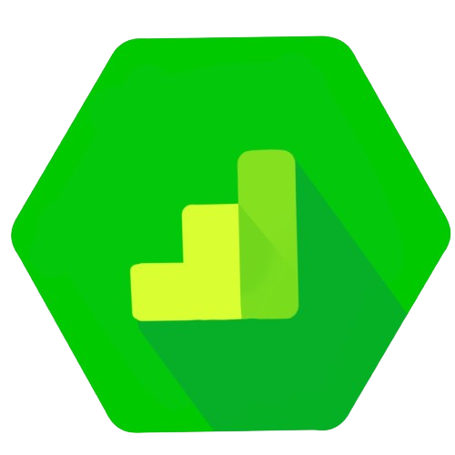

      

# dataform-ga4-helpers

`dataform-ga4-helpers` is a Dataform package providing common methods for `dataform-ga4-helpers` and `dataform-ga4-events` packages. You could also use it separate to reuse javascript helpers for GA4 raw dataset.

## Features

- Unnest event_parameters and user_properties
- Extract query_parameters from page_location
- Generate session_id and event_id
- Get first not null value from records
- Generate Select from JavaScript list of objects
- Declare GA4 source tables
